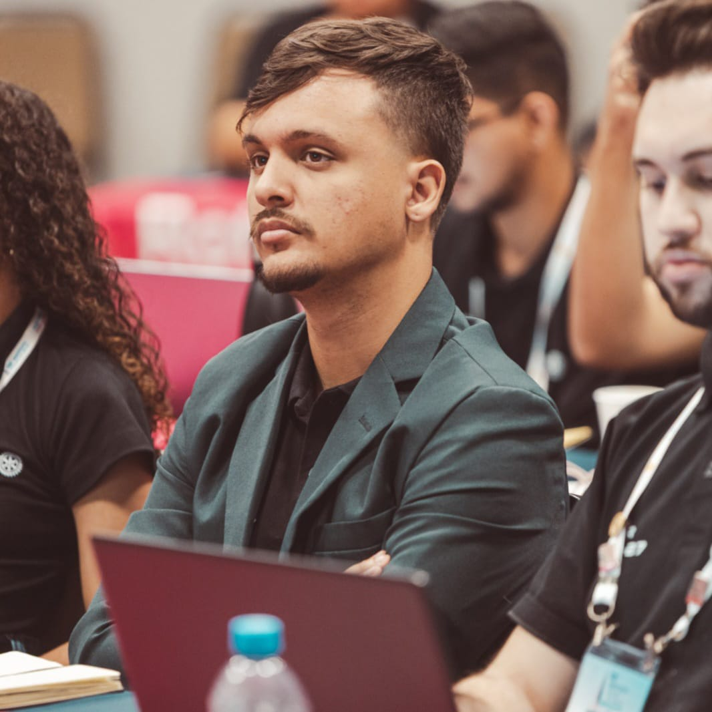
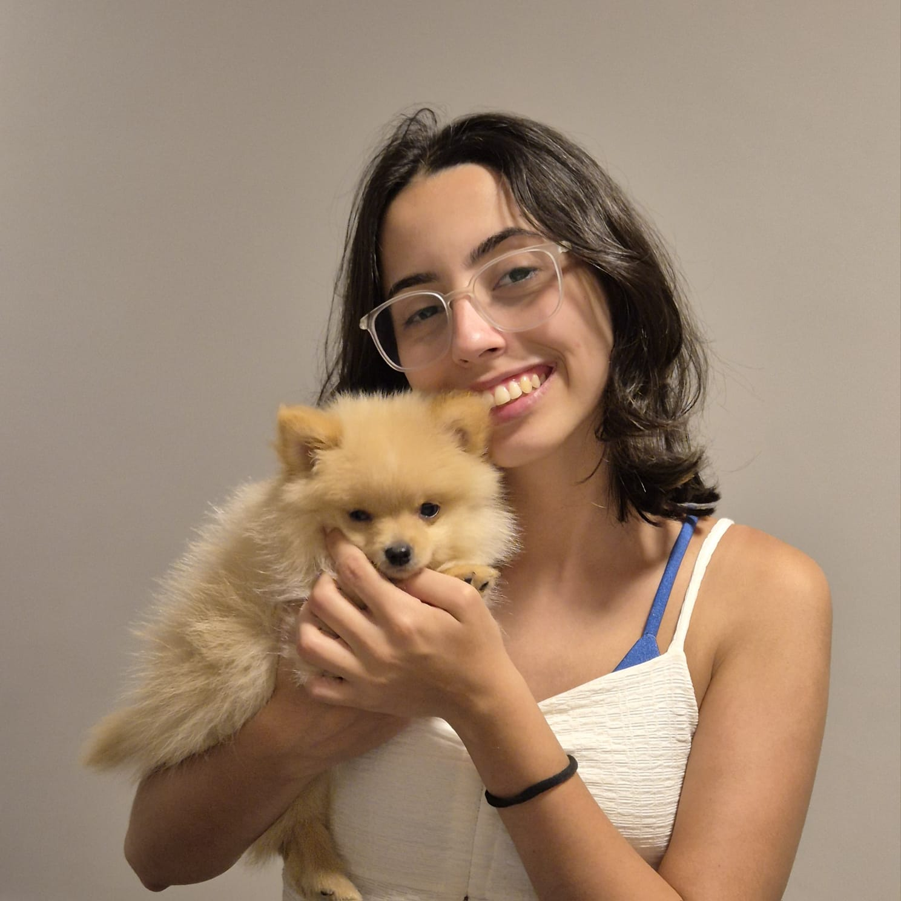

# PetConecta

Projeto desenvolvido como **Trabalho de Conclusão de Curso (TCC)** no curso de **Análise e Desenvolvimento de Sistemas da FATEC Rubens Lara – Baixada Santista**.

O **PetConecta** é uma aplicação mobile criada para facilitar o contato entre tutores de pets e prestadores de serviços, como veterinários, pet shops, cuidadores e ONGs. O objetivo é oferecer uma experiência simples, rápida e prática para quem busca serviços ou deseja divulgar seu trabalho.

---

## 🚀 Tecnologias Utilizadas

* **React Native** com **Expo**
* **Node.js** com **Express** (backend)
* **MongoDB**
* **API do Google Maps**

---

## 📱 Como rodar o projeto (Frontend - Expo)

### 1. Instalar as dependências

```bash
npm install
```

### 2. Ajustar o IP local no projeto

Antes de iniciar o app, é **necessário alterar o IP** para o IP da sua máquina:

* Abra o arquivo:

```
config.js
```

* Substitua o valor do IP pelo IP atual do seu computador

Isso é essencial para que o aplicativo consiga se comunicar corretamente com o backend.

### 3. Iniciar o aplicativo

Você pode usar **qualquer um dos comandos abaixo**:

```bash
npx expo start
```

ou

```bash
npm start
```

### 4. Rodar no celular

Instale o aplicativo **Expo Go** no seu smartphone.
Depois, basta escanear o QR Code exibido após iniciar o Expo.

---

## 🖥️ Como rodar o backend

1. Acesse a pasta do backend
2. Execute no terminal:

```bash
npm start
```

> **Importante:** O backend também exige que o IP correto esteja configurado em `config.js`.

---

## 📂 Estrutura do Projeto (resumo)

* `/frontend` – Aplicação em React Native
* `/backend` – API em Node.js com Express

---

## ✨ Desenvolvido por
<table>
  <tr>
    <td align="center">
      <br>
      <strong><span style="color:#000;">Arthur Duvareski</span></strong><br>
      <a href="https://github.com/ArthurDRF">        
        
      </a>
    </td>
    <td align="center">
      <br>
      <strong><span style="color:#000;">Bruno Peres</span></strong><br>
      <a href="https://github.com/brunocperez">
        
      </a>
    </td>
    <td align="center">
      <br>
      <strong><span style="color:#000;">Nathan Holtz</span></strong><br>
      <a href="https://github.com/nathanholtz">
        
      </a>
    </td>
    <td align="center">
      <br>
      <strong><span style="color:#000;">Yasmin Salgado</span></strong><br>
      <a href="https://github.com/ycsal">
        
      </a>
    </td>
  </tr>
</table>


---

TCC apresentado como parte dos requisitos para conclusão do curso de Análise e Desenvolvimento de Sistemas da FATEC Rubens Lara – 2025.
